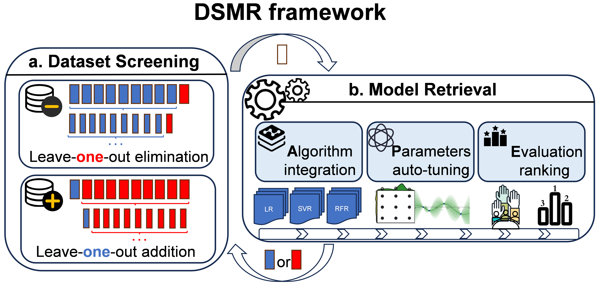

# DSMR
An AI Framework for Exploring Algorithm and Data Combinations with Efficiency-Accuracy Trade-offs

The primary goal of DSMR is to assess the importance of each row in the data matrix (i.e., each sample) and to provide materials scientists with the optimal combination of data subsets and models. 

Abstract：Machine learning models demonstrate remarkable capabilities in predicting properties of novel material. The optimal model can theoretically be obtained through an exhaustive search of data subsets, algorithms, and hyperparameters. However, the fundamental challenge lies in identifying the most efficient pathway through this immense search space. In this paper, we address this challenge by proposing an active learning-based exploration framework (DSMR), where the Data Screening (DS) module employs a "leave-one-out" strategy to dynamically refine the dataset through iterative elimination and addition of samples, while the Model Retrieval (MR) module integrates Bayesian optimization with hyperparameter exploration. The framework can achieve an ideal balance between computational efficiency and predictive accuracy, allowing for deeper exploration of data information. Systematic validation studies were conducted across two distinct sets each of classification and regression data. Superior models were obtained within 10 iterative cycles for all cases, achieving a 5-10% improvement compared to state-of-the-art results in current literature. Furthermore, the framework effectively utilizes newly added data to obtain enhanced models while featuring low-code implementation and user-friendly characteristics, making it a promising tool for materials design.

Key words： Active learning, Data enhancement, Model retrieval

